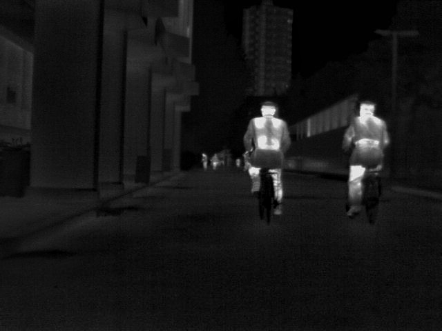
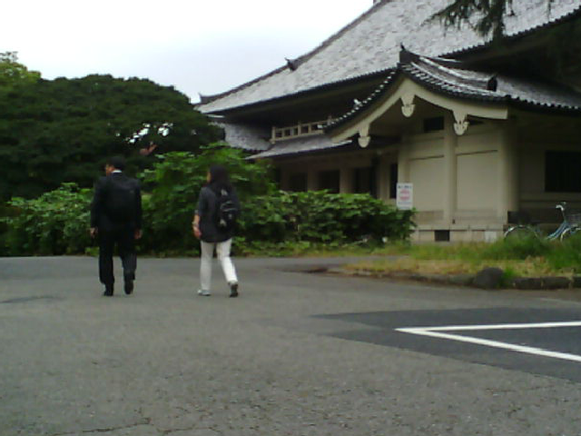
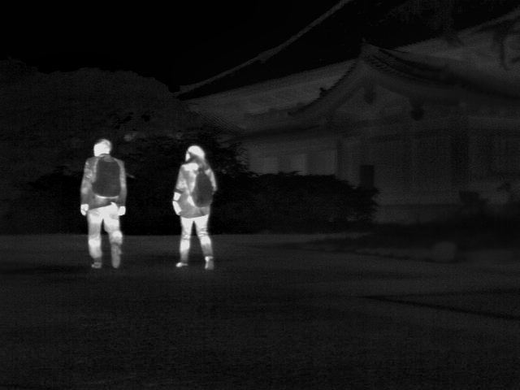
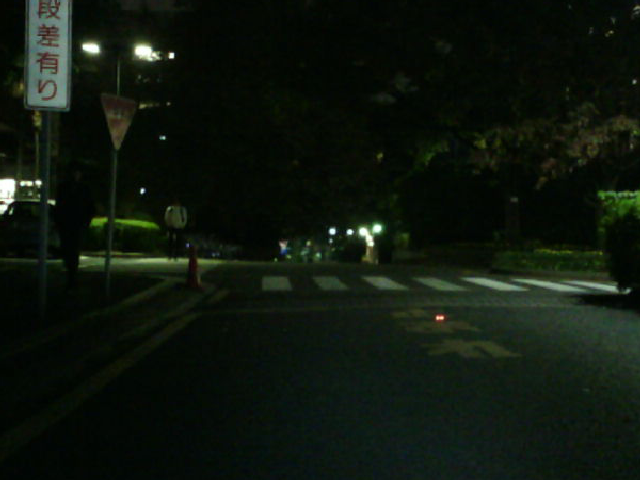
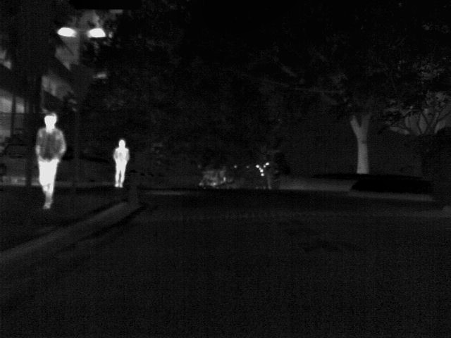
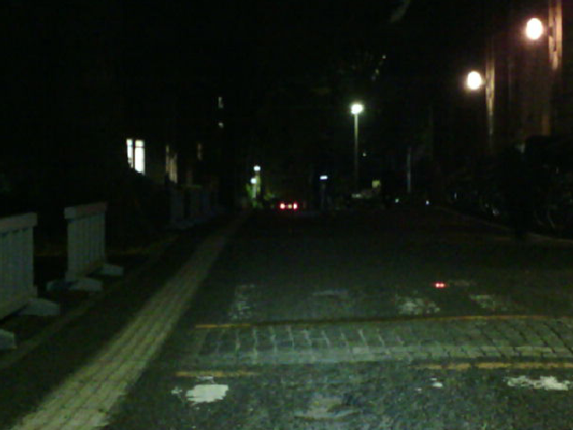
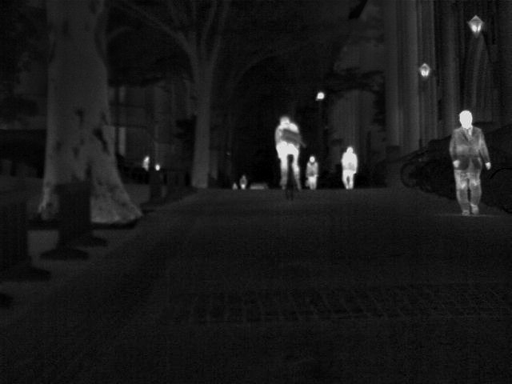

# MSRS: Multi-Spectral Road Scenarios for Practical Infrared and Visible Image Fusion 
[2025-9-10] 我们的论文 [Mask-DiFuser: A Masked Diffusion Model for Unified Unsupervised Image Fusion](https://ieeexplore.ieee.org/document/11162636) 被 **IEEE Transactions on Pattern Analysis and Machine Intelligence (IEEE TPAMI)** 正式接收! [[论文下载](https://ieeexplore.ieee.org/document/11162636)] [[Code](https://github.com/Linfeng-Tang/Mask-DiFuser)]

[2025-3-15] 我们的论文《[C2RF: Bridging Multi-modal Image Registration and Fusion via Commonality Mining and Contrastive Learning]([https://github.com/Linfeng-Tang/C2RF))》被《International Journal of Computer Vision》(IJCV)正式接收！[[论文下载](https://link.springer.com/article/10.1007/s11263-025-02427-1)] [[Code](https://github.com/Linfeng-Tang/C2RF)]

[2025-02-11] 我们发布了一个用于红外和可见光视频融合的大规模数据集：[M3SVD: Multi-Modal Multi-Scene Video Dataset](https://github.com/Linfeng-Tang/M3SVD).

We construct a new multi-spectral dataset for infrared and visible image fusion based on the **[MFNet](https://www.mi.t.u-tokyo.ac.jp/static/projects/mil_multispectral/)** dataset. The MFNet dataset contains 1,569 image pairs (820 taken at the daytime and 749 taken at nighttime) with spatial resolution is 480 × 640. However, There are many misaligned image pairs in the MFNet dataset and most infrared images are low signal-to-noise and low contrast. To this end, we first collect 715 daytime image pairs and 729 nighttime image pairs via removing 125 misaligned image pairs. Moreover, an image enhancement algorithm based on dark channel prior is leveraged to optimize the contrast and signal-to-noise of infrared images. As a result, the released new Multi-Spectral Road Scenarios (**MSRS**) dataset contains 1,444 pairs of aligned infrared and visible images with high quality.

You could run [visualize.py](https://github.com/Linfeng-Tang/MSRS/blob/main/visualize.py) to visualize segmentation labels 

Some typical examples are shown below(the left column are Vis images and the right column are IR images):
  

  

  

  

  

If this dataset is helpful to you, please cite it as:
```
@article{Tang2022PIAFusion,
  title={PIAFusion: A progressive infrared and visible image fusion network based on illumination aware},
  author={Tang, Linfeng and Yuan, Jiteng and Zhang, Hao and Jiang, Xingyu and Ma, Jiayi},
  journal={Information Fusion},
  year={2022},
  publisher={Elsevier}
}
```

```
@article{TangSeAFusion,
title = {Image fusion in the loop of high-level vision tasks: A semantic-aware real-time infrared and visible image fusion network},
author = {Linfeng Tang and Jiteng Yuan and Jiayi Ma},
journal = {Information Fusion},
volume = {82},
pages = {28-42},
year = {2022},
issn = {1566-2535},
publisher={Elsevier}
}
```

```
@article{Tang2022SuperFusion,
  title={SuperFusion: A versatile image registration and fusion network with semantic awareness},
  author={Tang, Linfeng and Deng, Yuxin and Ma, Yong and Huang, Jun and Ma, Jiayi},
  journal={IEEE/CAA Journal of Automatica Sinica},
  volume={9},
  number={12},
  pages={2121--2137},
  year={2022},
  publisher={IEEE}
}
```
```
@article{Ma2022SwinFusion,
  title={SwinFusion: Cross-domain Long-range Learning for General Image Fusion via Swin Transformer},
  author={Ma, Jiayi and Tang, Linfeng and Fan, Fan and Huang, Jun and Mei, Xiaoguang and Ma, Yong},
  journal={IEEE/CAA Journal of Automatica Sinica},
  volume={9},
  number={7},
  pages={1200--1217},
  year={2022},
  publisher={IEEE}
}
```

